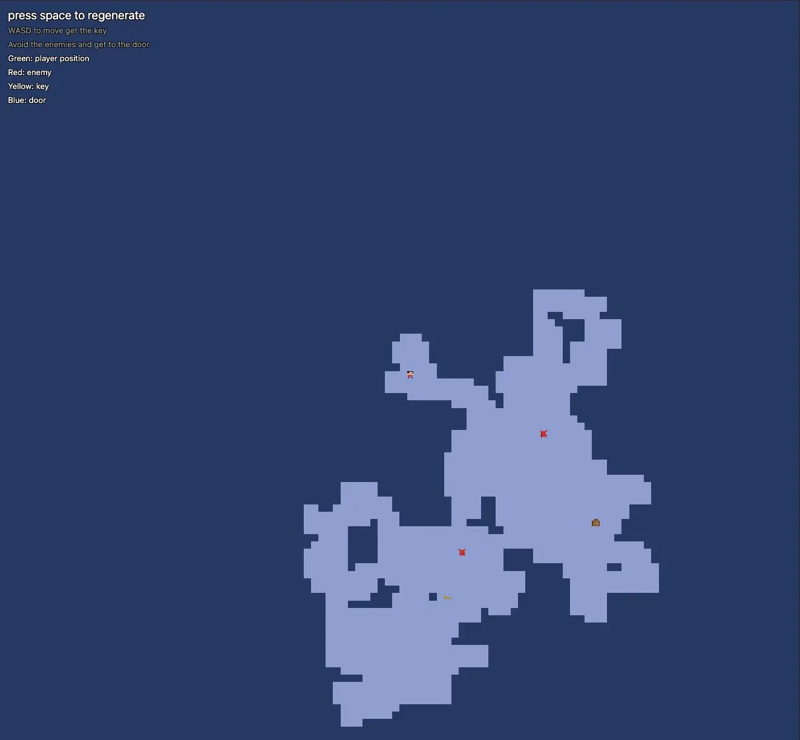

# Drunkard's Dungeon

A simple Rogue-like written in Javascript just for fun.
Using a simple `Drunkard's Walk` algorithm to generate pseudo-random dungeons.
Placing entities along the way on a separate entity canvas.

Pseudo turn-based, in that demons only move when you do.
Demons will patrol by walking in random directions each tick.
Once the player (you) are within a certain range of a demon, that demon will move towards you. *Even through walls at the momemnt, sorry*.
Also the "path finding" for the demons is willfully bad and doesn't always work. *Same could be said for most of the stuff in the game*.

## Objective

- Avoid your demons
- Collect the key
- Get to the door
- Repeat

## Play it on: [Netlify](https://drunkardsdungeon.netlify.app/)